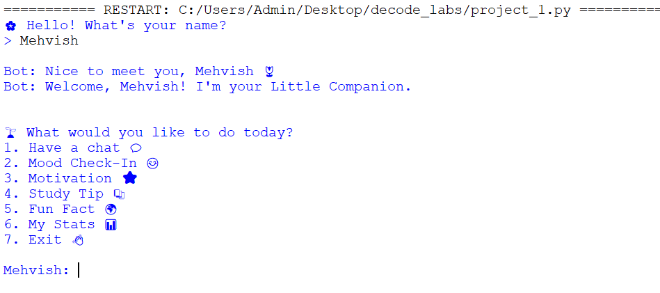
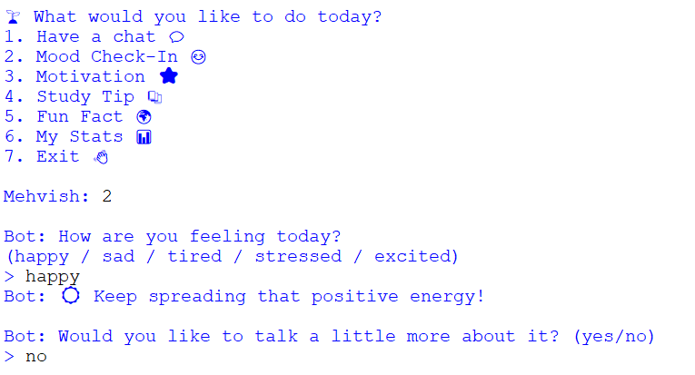
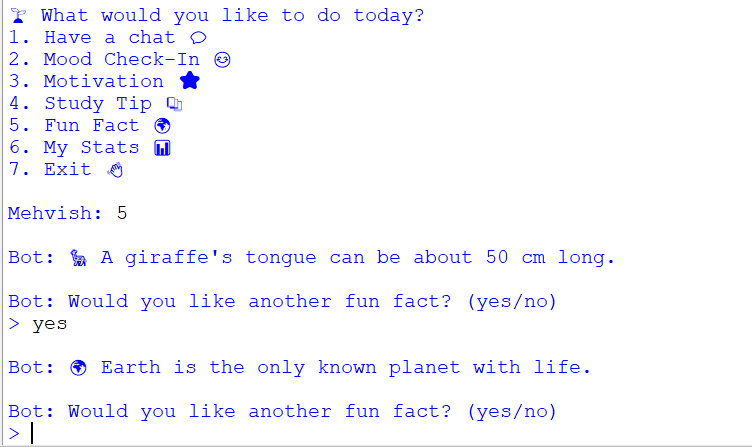

# 🌸 Little Companion Bot

## Overview

Little Companion Bot is a rule-based chatbot built using Python. It provides friendly conversations, mood check-ins, motivational quotes, study tips, fun facts, and session statistics through a simple interactive menu.

## Features

- Personalized greeting using the user's name
- Interactive menu system
- Mood Check-In
- Motivational quotes
- Study tips
- Fun facts
- Session statistics
- Continuous conversation loop
- Exit option

## Technologies Used

- Python
- If-Else Statements
- Loops
- Random Module

## How to Run

1. Open the project folder
2. Run `chatbot.py`
3. Enter your name
4. Choose an option from the menu

## Sample Options

- Have a chat 💬
- Mood Check-In 😊
- Motivation ⭐
- Study Tip 📚
- Fun Fact 🌍
- My Stats 📊

## Project Objective

This project was developed as part of the DecodeLabs Artificial Intelligence Internship Program. It demonstrates rule-based decision making, user interaction, and basic AI chatbot concepts.
## Screenshots

### Welcome Screen

### Mood Check-In

### Features

## Author

Mehvish
