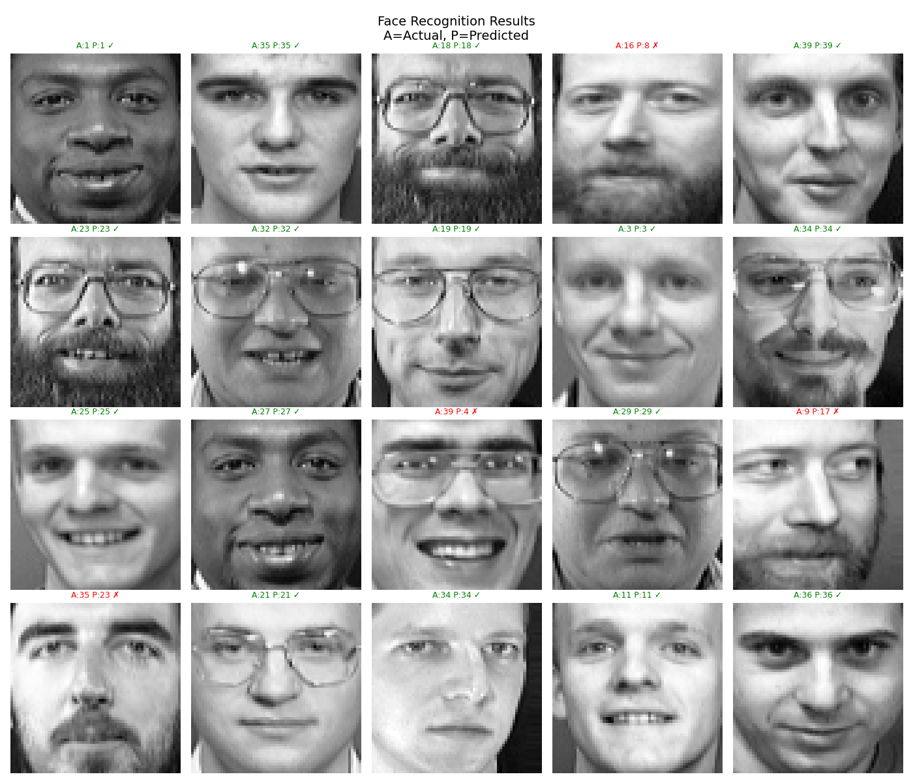
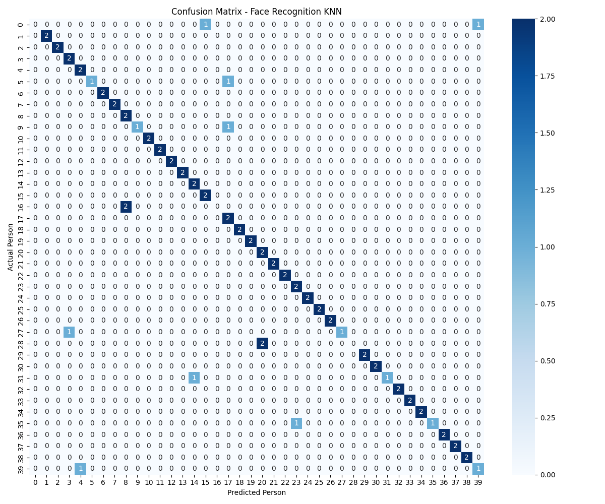

# 👤 Face Recognition Using K-Nearest Neighbors (KNN)

## Overview

This project implements a machine learning-based face recognition system using the K-Nearest Neighbors (KNN) algorithm. The model is trained on the Olivetti Faces dataset and learns to identify individuals based on facial features.

The system processes grayscale face images, applies feature scaling, trains a KNN classifier, and predicts the identity of people in unseen test images.

---

## Screenshots

### Face Recognition Predictions

The model predicts the identity of individuals from unseen facial images.



### Confusion Matrix

Visualization of actual versus predicted classifications across all individuals.



---

## Features

- Face recognition using K-Nearest Neighbors (KNN)
- Feature scaling using StandardScaler
- Train-test data splitting
- Classification performance evaluation
- Confusion matrix visualization
- Face prediction visualization
- Accuracy and F1-score reporting

---

## Dataset Information

The project uses the Olivetti Faces Dataset which contains:

- 400 grayscale facial images
- 40 different individuals
- 10 images per individual
- Image size: 64 × 64 pixels

The dataset includes variations in:

- Facial expressions
- Lighting conditions
- Facial details
- Presence or absence of glasses

---

## Technologies Used

- Python
- Scikit-Learn
- NumPy
- Matplotlib
- Seaborn

---

## Machine Learning Workflow

1. Load the Olivetti Faces dataset
2. Flatten each image into a feature vector
3. Normalize features using StandardScaler
4. Split data into training and testing sets
5. Train a KNN classifier (k = 5)
6. Predict identities on unseen images
7. Evaluate model performance
8. Visualize results

---

## Model Performance

| Metric | Value |
|----------|----------|
| Accuracy | 85% |
| Weighted F1 Score | 0.8208 |
| Training Samples | 320 |
| Testing Samples | 80 |
| Number of Classes | 40 Individuals |

---

```

## Installation

```
pip install scikit-learn numpy matplotlib seaborn
```

## Run the Project


python face_classifier.py


## Learning Outcomes

- Supervised Machine Learning
- KNN Classification
- Feature Scaling
- Image Data Processing
- Model Evaluation
- Face Recognition Fundamentals

## Project Objective

This project was developed as part of the DecodeLabs Artificial Intelligence Internship Program. It demonstrates the implementation of a machine learning classification model for facial recognition using real-world image data.

## Author

Mehvish
