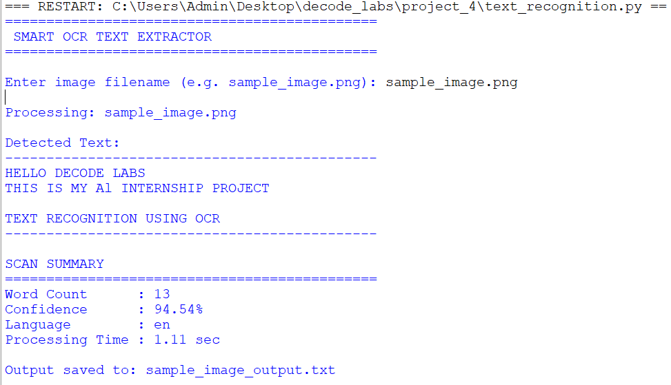
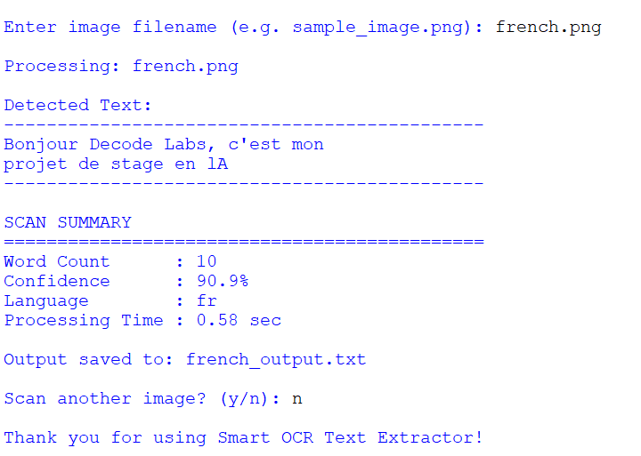

# 🧠 Smart OCR Text Recognition System

## Overview

Smart OCR Text Recognition System is a Python-based Optical Character Recognition (OCR) application that extracts text from images using Tesseract OCR.

The application enhances image quality before processing, detects the language of extracted text, calculates OCR confidence scores, measures processing time, and automatically generates text reports.

## Features

* OCR-based text extraction from images
* Image preprocessing for improved recognition accuracy
* Automatic language detection
* Confidence score calculation
* Word count analysis
* Processing time measurement
* Multi-image scanning support
* Automatic text report generation
* Interactive command-line interface

## Technologies Used

* Python
* Tesseract OCR
* PyTesseract
* Pillow (PIL)
* LangDetect

## Installation

Install required libraries:

```bash
pip install pytesseract Pillow langdetect
```

Install Tesseract OCR and update the path in the script if required.

## How to Run

```bash
python text_recognition.py
```

Enter the image filename when prompted.

Example:

```text
sample_image.png
```

## Sample Output

```text
Detected Text:

HELLO DECODE LABS

THIS IS MY AI INTERNSHIP PROJECT

TEXT RECOGNITION USING OCR

Word Count      : 13
Confidence      : 94.54%
Language        : en
Processing Time : 1.11 sec
```

## Screenshots

### English Text Recognition



### MultiLanguage Detection Example



## Key Functionalities Demonstrated

* Text extraction from images
* Automatic language detection
* Confidence score reporting
* Processing time measurement
* Multi-image processing
* Text report generation

## Project Objective

This project was developed as part of the DecodeLabs Artificial Intelligence Internship Program.

It demonstrates Optical Character Recognition (OCR), image preprocessing, language detection, and text analysis using Python.

## Author

Mehvish
